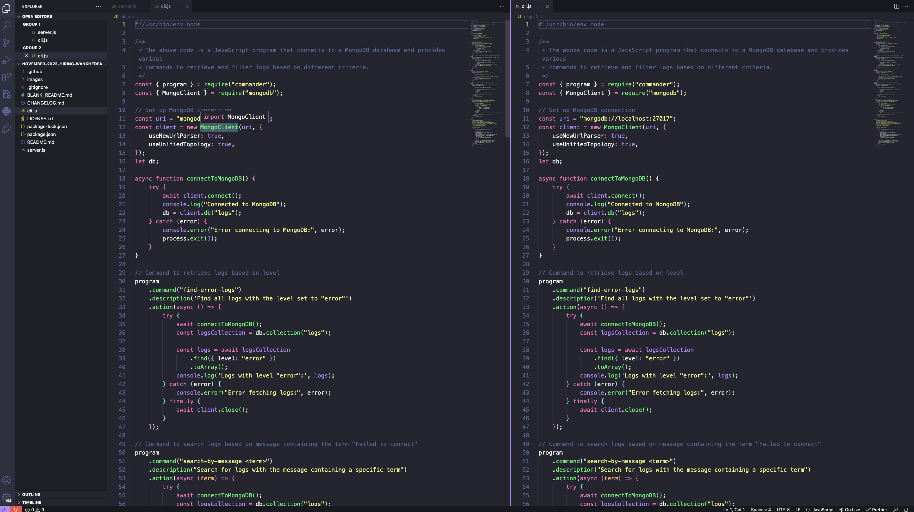
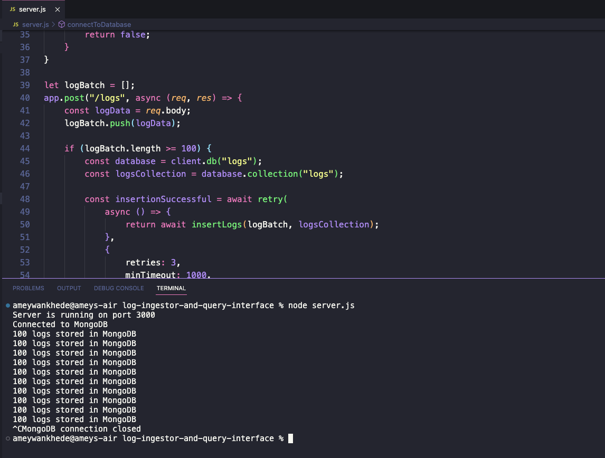
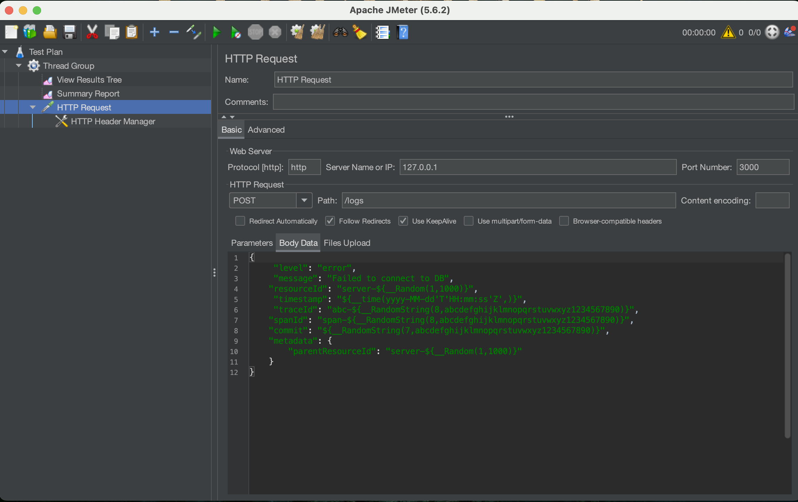
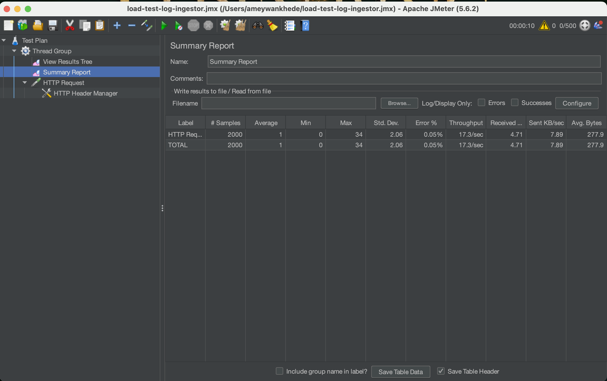
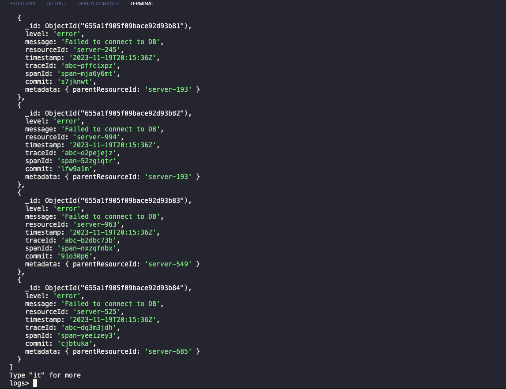
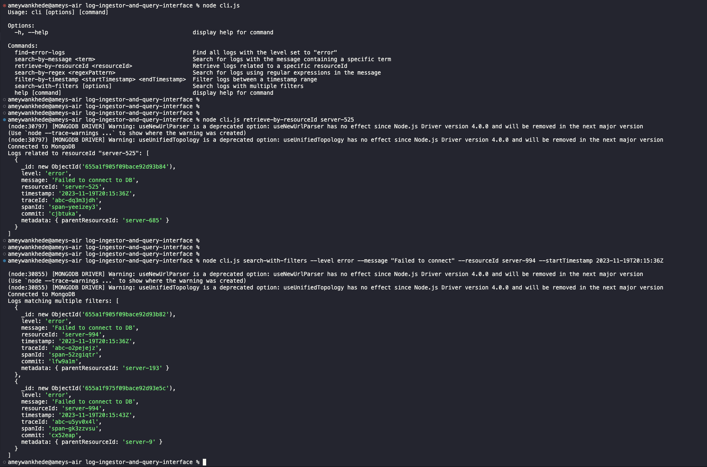

<!-- Improved compatibility of back to top link: See: https://github.com/othneildrew/Best-README-Template/pull/73 -->
<a name="readme-top"></a>
<!--
*** Thanks for checking out the Best-README-Template. If you have a suggestion
*** that would make this better, please fork the repo and create a pull request
*** or simply open an issue with the tag "enhancement".
*** Don't forget to give the project a star!
*** Thanks again! Now go create something AMAZING! :D
-->


<!-- PROJECT SHIELDS -->
<!--
*** I'm using markdown "reference style" links for readability.
*** Reference links are enclosed in brackets [ ] instead of parentheses ( ).
*** See the bottom of this document for the declaration of the reference variables
*** for contributors-url, forks-url, etc. This is an optional, concise syntax you may use.
*** https://www.markdownguide.org/basic-syntax/#reference-style-links
-->
[![Contributors][contributors-shield]][contributors-url]
[![Forks][forks-shield]][forks-url]
[![Stargazers][stars-shield]][stars-url]
[![Issues][issues-shield]][issues-url]
[![MIT License][license-shield]][license-url]
[![LinkedIn][linkedin-shield]][linkedin-url]


<!-- PROJECT LOGO -->
<br />
<div align="center">
  <a href="https://github.com/WankhedeAmey/Log-Ingestor-and-Query-Interface.git">
    
  </a>

<h3 align="center">Log Ingestor and Query Interface</h3>

  <p align="center">
    A Node-js based log ingestion server capable of receiving and storing log data in a MongoDB database. Additionaly, it offers a CLI(command line interface) that gives simple yet powerful search system to query logs based on level, message, resourceID and timestamp. 
    <br />
    <a href="https://github.com/WankhedeAmey/Log-Ingestor-and-Query-Interface"><strong>Explore the docs »</strong></a>
    <br />
    <br />
    <a href="https://github.com/WankhedeAmey/Log-Ingestor-and-Query-Interface.git">View Demo</a>
    ·
    <a href="https://github.com/WankhedeAmey/Log-Ingestor-and-Query-Interface/issues">Report Bug</a>
    ·
    <a href="https://github.com/WankhedeAmey/Log-Ingestor-and-Query-Interface/issues">Request Feature</a>
  </p>
</div>


<!-- TABLE OF CONTENTS -->
<details>
  <summary>Table of Contents</summary>
  <ol>
    <li>
      <a href="#about-the-project">About The Project</a>
      <ul>
        <li><a href="#built-with">Built With</a></li>
      </ul>
    </li>
    <li>
      <a href="#getting-started">Getting Started</a>
      <ul>
        <li><a href="#prerequisites">Prerequisites</a></li>
        <li><a href="#installation">Installation</a></li>
      </ul>
    </li>
    <li><a href="#usage">Usage</a></li>
    <li><a href="#roadmap">Roadmap</a></li>
    <li><a href="#contributing">Contributing</a></li>
    <li><a href="#license">License</a></li>
    <li><a href="#contact">Contact</a></li>
    <li><a href="#acknowledgments">Acknowledgments</a></li>
  </ol>
</details>


<!-- ABOUT THE PROJECT -->
## About The Project



## Features 
### Log Ingestor
* Accepts incoming log data via HTTP POST requests. 
* Gathers incoming logs into batches to optimize storage and processing.
* Implements a retry strategy to handle intermittent failures during log storage.
* Provides endpoints for log receipt and essential functionalities like health checks.
* Establishes a connection with MongoDB for efficient and reliable log storage.
* Employs logging mechanisms for effective debugging and error management.
* Designed to handle high loads and scale for increased log ingestion requirements.
* Ensures stability and reliability in log data handling and storage processes.
* Allows configuration of the batch size for optimal performance based on workload.

### CLI 
* Search logs by level: `node cli.js find-error-logs`
* Search logs by message: `node cli.js search-by-message "Failed to connect"`
* Retrieve logs by resourceId: `node cli.js retrieve-by-resourceId "server-1234"`
* Search logs using regex: `node cli.js search-by-regex "pattern"`
* Search logs with multiple filters: `node cli.js search-with-filters --level=error --message="Failed to connect"`


<p align="right">(<a href="#readme-top">back to top</a>)</p>


### Built With

* JavaScript
* Node.js
* Express.js
* MongoDB

<p align="right">(<a href="#readme-top">back to top</a>)</p>


<!-- GETTING STARTED -->
## Getting Started

### Prerequisites

For the package to work, download the Node.js and MongoDB from the official sites and install them on the system.

### Installation

1. Get a free API Key at [https://example.com](https://example.com)
2. Clone the repo
   ```sh
   git https://github.com/dyte-submissions/november-2023-hiring-WankhedeAmey.git
   ```
3. Open the repository in your favourite text-editor. 
4. Install all the dependencies.
   ```sh
   npm install
   ```
5.For the purpose of load testing, I've used JMeter to simulate the load. This also helps in generating random POST requests that will eventually be stored into the MongoDB. 
For the Jmeter installation, refer https://jmeter.apache.org/download_jmeter.cgi


<p align="right">(<a href="#readme-top">back to top</a>)</p>


<!-- USAGE EXAMPLES -->
## Usage

1. Start the server with
```sh
node server.js
```
NOTE: Post requests are accepted at ```/logs``` endpoint.
2. For mongoDB to run, ensure that mongoDB service is running in the background. Refer https://www.mongodb.com/docs/manual/administration/install-community/ for the installation process.
4. Once few logs are ingested, you can search the logs using CLI. Run the following command, this will mention all the options that are available to run.
```sh
node cli.js
```
5. Run the command with options related to the query
```sh
node cli.js <option>
```
6. Using the JMeter, I've simulated a vast load of POST requests. To make each POST request different so that queries can be tested, we can use JMeter functions. In the POST request body inside JMeter application, paste the following JSON body. To add different levels, you can also customize this body as FATAL, INFO, TRACE levels.

```sh
{
	"level": "error",
	"message": "Failed to connect to DB",
    "resourceId": "server-${__Random(1,1000)}",
	"timestamp": "${__time(yyyy-MM-dd'T'HH:mm:ss'Z',)}",
	"traceId": "abc-${__RandomString(8,abcdefghijklmnopqrstuvwxyz1234567890)}",
    "spanId": "span-${__RandomString(8,abcdefghijklmnopqrstuvwxyz1234567890)}",
    "commit": "${__RandomString(7,abcdefghijklmnopqrstuvwxyz1234567890)}",
    "metadata": {
        "parentResourceId": "server-${__Random(1,1000)}"
    }
}
```

<p align="right">(<a href="#readme-top">back to top</a>)</p>

## Results 
# Server 


# JMeter(Used to load-test and populate mongoDB)



# MongoDB logs being stored succesfully


# CLI working as expected



<!-- ROADMAP -->
## Roadmap

See the [open issues](https://github.com/WankhedeAmey/Log-Ingestor-and-Query-Interface/issues) for a full list of proposed features (and known issues).

<p align="right">(<a href="#readme-top">back to top</a>)</p>

<!-- LICENSE -->
## License

Distributed under the MIT License. See `LICENSE.txt` for more information.

<p align="right">(<a href="#readme-top">back to top</a>)</p>


<!-- CONTACT -->
## Contact

Amey Wankhede - +91 7083583847 - wankhede.ameyb@gmail.com

Project Link: https://github.com/WankhedeAmey/Log-Ingestor-and-Query-Interface

<p align="right">(<a href="#readme-top">back to top</a>)</p>


<!-- MARKDOWN LINKS & IMAGES -->
<!-- https://www.markdownguide.org/basic-syntax/#reference-style-links -->
[contributors-shield]: https://img.shields.io/github/contributors/github_username/repo_name.svg?style=for-the-badge
[contributors-url]: https://github.com/WankhedeAmey/Log-Ingestor-and-Query-Interface/tree/main
[forks-shield]: https://img.shields.io/github/forks/github_username/repo_name.svg?style=for-the-badge
[forks-url]: https://github.com/github_username/repo_name/network/members
[stars-shield]: https://img.shields.io/github/stars/github_username/repo_name.svg?style=for-the-badge
[stars-url]: https://github.com/github_username/repo_name/stargazers
[issues-shield]: https://img.shields.io/github/issues/github_username/repo_name.svg?style=for-the-badge
[issues-url]: https://github.com/github_username/repo_name/issues
[license-shield]: https://img.shields.io/github/license/github_username/repo_name.svg?style=for-the-badge
[license-url]: https://github.com/github_username/repo_name/blob/master/LICENSE.txt
[linkedin-shield]: https://img.shields.io/badge/-LinkedIn-black.svg?style=for-the-badge&logo=linkedin&colorB=555
[linkedin-url]: https://linkedin.com/in/amey-wankhede/
[product-screenshot]: images/screenshot.png
[Next.js]: https://img.shields.io/badge/next.js-000000?style=for-the-badge&logo=nextdotjs&logoColor=white
[Next-url]: https://nextjs.org/
[React.js]: https://img.shields.io/badge/React-20232A?style=for-the-badge&logo=react&logoColor=61DAFB
[React-url]: https://reactjs.org/
[Vue.js]: https://img.shields.io/badge/Vue.js-35495E?style=for-the-badge&logo=vuedotjs&logoColor=4FC08D
[Vue-url]: https://vuejs.org/
[Angular.io]: https://img.shields.io/badge/Angular-DD0031?style=for-the-badge&logo=angular&logoColor=white
[Angular-url]: https://angular.io/
[Svelte.dev]: https://img.shields.io/badge/Svelte-4A4A55?style=for-the-badge&logo=svelte&logoColor=FF3E00
[Svelte-url]: https://svelte.dev/
[Laravel.com]: https://img.shields.io/badge/Laravel-FF2D20?style=for-the-badge&logo=laravel&logoColor=white
[Laravel-url]: https://laravel.com
[Bootstrap.com]: https://img.shields.io/badge/Bootstrap-563D7C?style=for-the-badge&logo=bootstrap&logoColor=white
[Bootstrap-url]: https://getbootstrap.com
[JQuery.com]: https://img.shields.io/badge/jQuery-0769AD?style=for-the-badge&logo=jquery&logoColor=white
[JQuery-url]: https://jquery.com 
